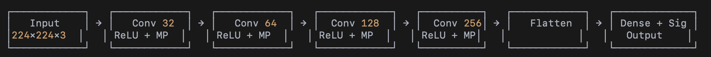

# 🫁 PneumoAI - Pneumonia Detection System

An AI-powered web application for detecting pneumonia from chest X-ray images using deep learning.



<br>

## 🌟 Features

- **AI-Powered Detection** - Upload chest X-rays and get instant pneumonia predictions
- **Real-time Analysis** - Fast predictions with confidence scores
- **Educational Content** - Learn about pneumonia symptoms and detection
- **Responsive Design** - Works seamlessly on desktop and mobile devices
- **Modern UI** - Beautiful dark theme with smooth animations

<br>

## 🚀 Live Demo

- **Frontend**: https://pneumo-ai-smoky.vercel.app/
- **Backend API (live demo)**: https://vish-05-xray-pneumonia-backend.hf.space

<br>  

## 🛠️ Tech Stack

### Frontend
- **React.js** - UI library
- **Tailwind CSS** - Styling
- **Lucide React** - Icons
- **Gradio Client** - Backend communication

### Backend
- **Python** - Programming language
- **TensorFlow/Keras** - Deep learning framework
- **Gradio** - API interface
- **Hugging Face Spaces** - Hosting

### Deployment
- **Vercel** - Frontend hosting
- **Hugging Face Spaces** - Backend hosting

<br>

## 📊 Model Performance

| Metric | Value |
|--------|-------|
| Accuracy | 87.36% |
| Precision | 89.22% |

<br>

## 🧠 Model Architecture

Custom VGG-inspired Convolutional Neural Network (CNN):

- **Input Layer**: 150 x 150 x 1 (Grayscale)
- **Convolutional Layers**: 5 layers with increasing filters (32 → 256)
- **Pooling Layers**: Max pooling with 2 x 2 kernels
- **Fully Connected Layers**: 1 hidden dense layer (128 neurons)
- **Output Layer**: Sigmoid activation (Binary classification)

### Training Details

- **Framework**: TensorFlow 2.18
- **Optimizer**: Adam
- **Learning Rate**: 0.0001
- **Batch Size**: 32
- **Epochs**: 50
- **Loss Function**: Binary Crossentropy

<br>

## 📁 Dataset

**Chest X-Ray Images (Pneumonia) Dataset**

- **Source**: [Kaggle](https://www.kaggle.com/datasets/paultimothymooney/chest-xray-pneumonia)

<br>

## 🖥️ Local Development

### Prerequisites

- Node.js 18+
- npm or yarn

### Frontend Setup

```bash
# Clone the repository
git clone https://github.com/vis-05/pneumo-ai.git

# Navigate to project directory
cd pneumo-ai

# Install dependencies
npm install

# Start development server
npm start
```

The app will run at `http://localhost:3000`

<br>

## 🔧 Backend

The backend is hosted on Hugging Face Spaces using Gradio.

### Backend Repository

🔗 Hugging Face Space - https://huggingface.co/spaces/vish-05/xray-pneumonia-backend/tree/main

### Backend Stack

- **Python 3.10**
- **TensorFlow CPU**
- **Gradio**
- **Pillow**
- **NumPy**

### API Endpoint

The frontend connects to the backend using the Gradio client:

```javascript
const client = await Client.connect("vish-05/xray-pneumonia-backend");
const result = await client.predict("/predict", { image: uploadedImage });
```

<br>

## 📂 Project Structure

```
pneumo-ai/
├── public/
│   ├── images/
│   ├── index.html
│   ├── manifest.json
│   ├── robots.txt
│   └── favicon.svg
├── src/
│   ├── App.js
│   ├── index.js
│   └── index.css
├── package.json
├── package-lock.json
├── tailwind.config.js
├── postcss.config.js
├── vercel.json
├── .gitignore
├── .vercelignore
├── vercel
└── README.md
```

<br>

## 🚀 Deployment

### Frontend (Vercel)

1. Push code to GitHub
2. Connect repository to Vercel
3. Deploy automatically

### Backend (Hugging Face)

1. Create a new Space on Hugging Face
2. Select Gradio SDK
3. Upload `app.py`, `requirements.txt`, and `model_final.h5`
4. Space builds and deploys automatically

<br>

## 📝 License

MIT License - feel free to use this project for learning and development.
